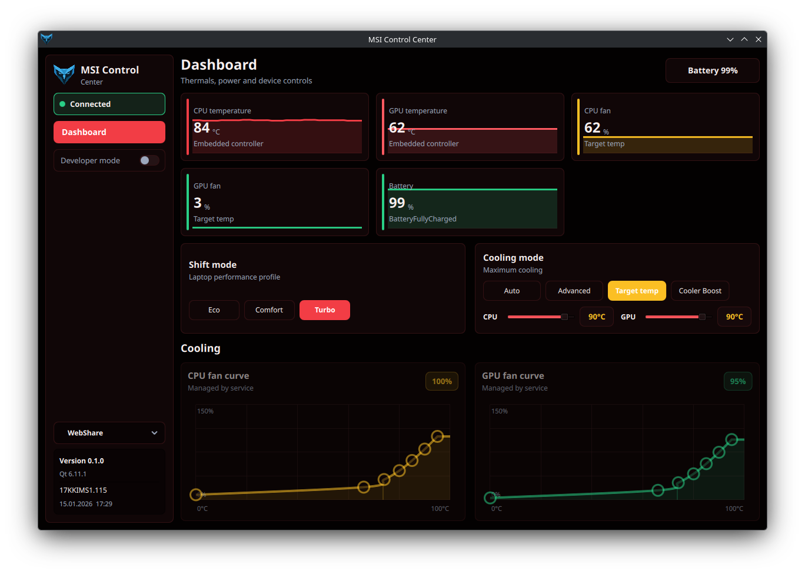
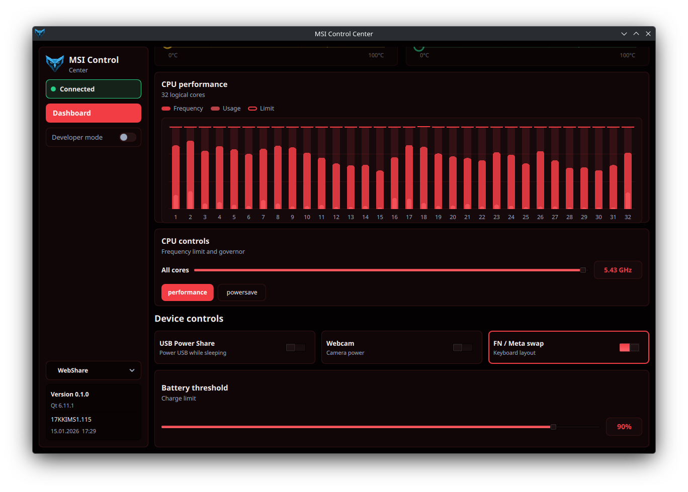
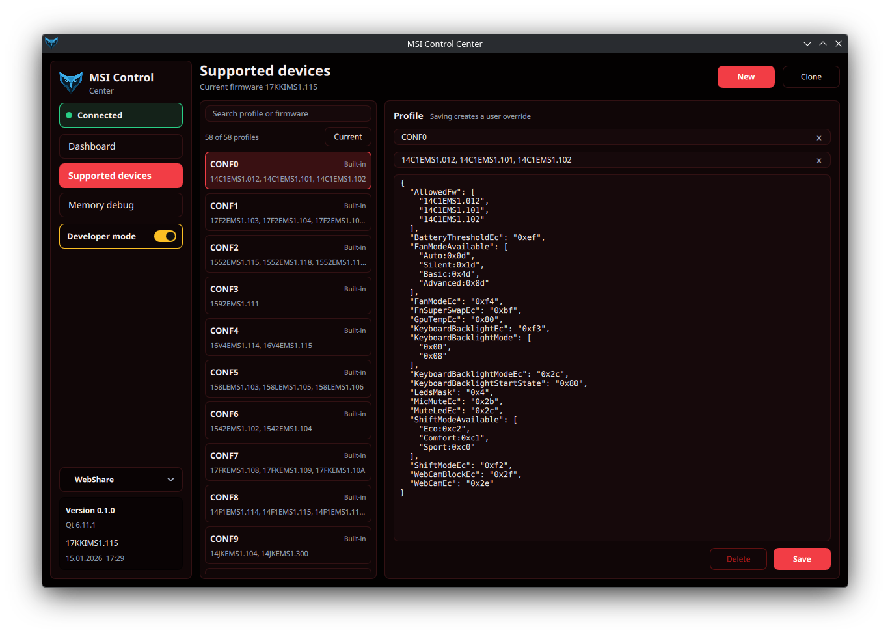
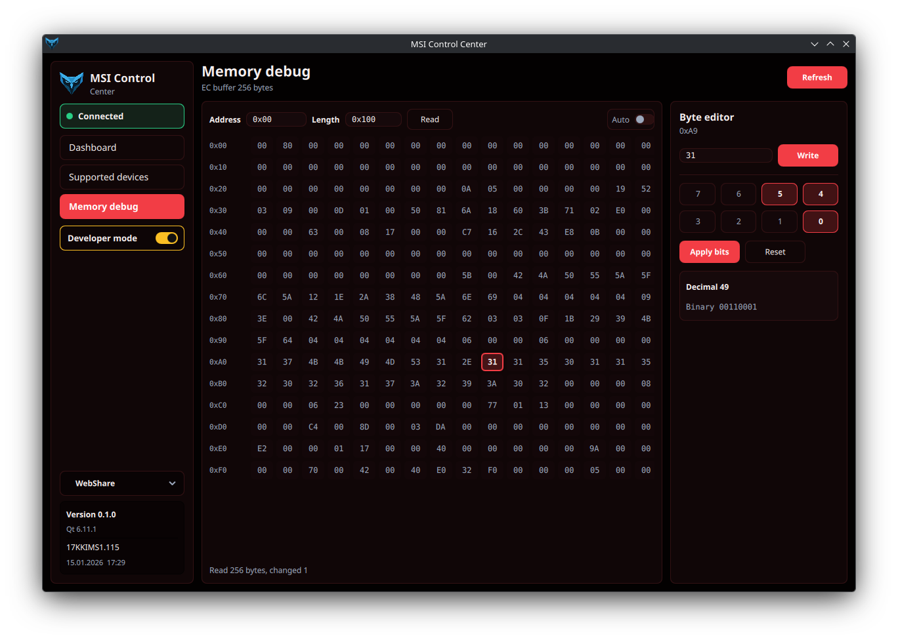

[](https://forgejo.acnas.net/app/msicontroller/actions/workflows/ci.yml/badge.svg?branch=main)

# MSI Control Center

**MSI Control Center** is a Linux control panel for supported MSI laptops. It combines a Qt 6 desktop client, a system D-Bus service, a helper library, and an EC kernel module for monitoring thermals and controlling laptop-specific features.

DEB, RPM, and Arch packages bundle Qt under `/opt/msicontroller`. All install the same client, system service, and DKMS kernel module.

## Features

- Live temperatures, fan speeds, battery status, and CPU/GPU controls.
- Cooling modes, fan curves, shift modes, keyboard backlight, and battery charge settings where supported by firmware.
- Built-in and editable MSI device profiles, with JSON import and export.
- Diagnostics, a support bundle, and the `msicontroller-doctor` command.
- Russian translation, desktop launcher, system tray, and a fake EC backend for development.

Available controls depend on the detected firmware profile in `src/service/supported-devices.json`.

## Screenshots

**Dashboard and cooling controls**



**CPU performance and device controls**



**Supported device profiles**



**EC memory debugger**



## Architecture

The Qt/QML client talks to a privileged system D-Bus service. The service owns EC access and validates raw writes against the active device profile. DKMS builds the EC kernel module for installed kernels with matching headers.

## Installation

Download the package for your distribution from a [Forgejo release](https://forgejo.acnas.net/app/msicontroller/releases) or CI artifacts. Install headers matching your running kernel first; DKMS uses them to build the module. On Arch/Omarchy, a dependency on `linux-headers` would pull headers for the stock Arch kernel even if you use another kernel.

| Distribution | Install downloaded package |
| --- | --- |
| Debian / Ubuntu | `sudo apt install ./msicontroller-*.deb` |
| Fedora / RPM | `sudo dnf install ./msicontroller-*.rpm` |
| Arch / Omarchy | `sudo pacman -U ./msicontroller-*.pkg.tar.zst` |

Run the command in a directory containing only the package you downloaded. All filenames follow `msicontroller-version-release-architecture` plus the package extension.

The packages set up the signed Forgejo repository for future updates. On Arch, the package checks the bundled public key before trusting it and removes its repository entry when uninstalled. No manual `pacman.conf` edit is needed.

The service is enabled and started during package installation; on Arch it starts after DKMS finishes.

Update as usual with `sudo apt update && sudo apt upgrade`, `sudo dnf upgrade`, or `sudo pacman -Syu`. Launch **MSI Control Center** from the application menu. If DKMS fails, check that your running kernel has matching headers and run `dkms status -m msiecmodule`.

## Building and Testing

- DEB/RPM: run `./scripts/build-packages-docker.sh` to build with Qt 6.11.1 in Docker. Packages are written to `packages/`.
- Arch: install `base-devel`, `git`, and `python`, then run `./scripts/build-arch-package.sh` as a regular user. `makepkg` installs remaining dependencies through pacman; `aqtinstall` downloads Qt 6.11.1 into a local cache. The package is written to `packages/`.
- Package install tests: run `./scripts/test-packages-docker.sh`.
- Unit tests: run `ctest --test-dir build --output-on-failure` after a CMake build.

Forgejo CI builds and tests all three package formats. Tagged releases publish the packages to the Forgejo registry, so later versions arrive through the normal package manager.

For a source build on Debian/Ubuntu, install Qt 6 development packages, CMake, Ninja, D-Bus and systemd development files, and matching kernel headers, then run:

```sh
cmake -S . -B build -G Ninja
cmake --build build
sudo cmake --install build
```

For diagnostics, run `systemctl status msi-ec-service`. The client and doctor binaries are under `/opt/msicontroller/bin/` on all three distributions.

## Supported Laptops

The built-in database contains 21 MSI EC profiles covering 373 exact firmware versions. Check your EC firmware version in [`src/service/supported-devices.json`](src/service/supported-devices.json); available features depend on the matching profile.

Built-in profiles are shipped in `src/service/supported-devices.json`. User profiles and overrides are written by the service to `/etc/MsiController/supported-devices.json` and can be managed from the client via **Supported devices** in the left panel. Profiles can also be imported from and exported to JSON files from the same page. Saved profile changes are applied live: the service rebuilds the active EC parameter set, refreshes the raw-write safety allowlist, and the client refreshes without restarting the service. User profile files are schema-versioned for forward-compatible migrations.

### Regenerating Device Profiles

The built-in JSON database can be regenerated manually from the C configurations in [BeardOverflow/msi-ec](https://github.com/BeardOverflow/msi-ec):

```sh
scripts/generate-supported-devices-from-msi-ec.py --dry-run > /tmp/supported-devices.json
scripts/generate-supported-devices-from-msi-ec.py --output src/service/supported-devices.json
```

To use an already cloned upstream repository:

```sh
scripts/generate-supported-devices-from-msi-ec.py --source-dir /path/to/msi-ec --output src/service/supported-devices.json
```

The script is not part of the application runtime. It parses upstream `msi-ec.c` / `ec_memory_configuration.h`, keeps MsiController-only defaults for battery status and USB power share, and writes explicit EC addresses into every generated profile so unsupported upstream fields do not fall back to stale defaults.

## Contact / Support

- Email: mikhail@acnas.net  
- Telegram: [@AcNasRu](https://t.me/AcNasRu)
- LinkedIn: [Mikhail Bulatov](https://www.linkedin.com/in/mikhail-bulatov-13277a253/)

## Acknowledgements

Special thanks to [BeardOverflow/msi-ec](https://github.com/BeardOverflow/msi-ec) for inspiration.

## License

This project is licensed under the MIT License.

**Note:** This project uses the Qt framework, which is licensed under the GNU Lesser General Public License (LGPL) version 3.  
See [https://www.qt.io/licensing](https://www.qt.io/licensing) and the `LICENSE.LGPL3` file for details.

```
MIT License

Permission is hereby granted, free of charge, to any person obtaining a copy
of this software and associated documentation files (the "Software"), to deal
in the Software without restriction, including without limitation the rights
to use, copy, modify, merge, publish, distribute, sublicense, and/or sell
copies of the Software, and to permit persons to whom the Software is
furnished to do so, subject to the following conditions:

The above copyright notice and this permission notice shall be included in all
copies or substantial portions of the Software.

THE SOFTWARE IS PROVIDED "AS IS", WITHOUT WARRANTY OF ANY KIND, EXPRESS OR
IMPLIED, INCLUDING BUT NOT LIMITED TO THE WARRANTIES OF MERCHANTABILITY,
FITNESS FOR A PARTICULAR PURPOSE AND NONINFRINGEMENT. IN NO EVENT SHALL THE
AUTHORS OR COPYRIGHT HOLDERS BE LIABLE FOR ANY CLAIM, DAMAGES OR OTHER
LIABILITY, WHETHER IN AN ACTION OF CONTRACT, TORT OR OTHERWISE, ARISING FROM,
OUT OF OR IN CONNECTION WITH THE SOFTWARE OR THE USE OR OTHER DEALINGS IN THE
SOFTWARE.
```
