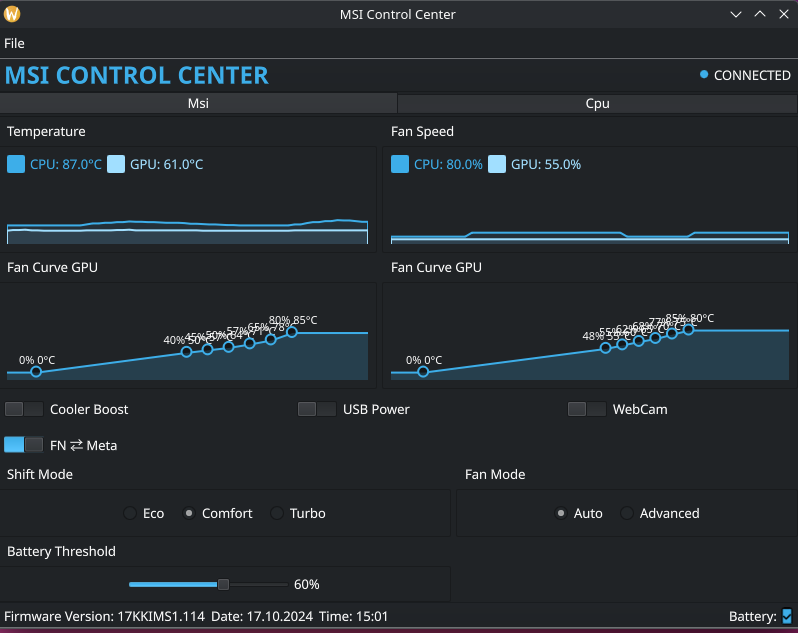

[](https://gitlab.acnas.net/app/msicontroller/-/pipelines)
[](https://forgejo.acnas.net/app/msicontroller/actions/workflows/ci.yml)

# MsiController

**MsiController** is a comprehensive project for managing and monitoring MSI devices on Linux. The project consists of several components: a service, a client application, a helper library, and a kernel module.

## Features

- Fan control and monitoring (CPU/GPU)
- Shift mode switching (Eco, Comfort, Sport, Turbo)
- Keyboard backlight control (where supported)
- Super Battery mode (where supported)
- Mic mute and LED control (where supported)
- Battery charge threshold management
- Cooler Boost support
- Webcam toggle (where supported)
- System tray integration (client)
- Modern Qt6/QML graphical interface
- D-Bus and systemd integration
- Modular architecture (service, client, kernel module, helper library)
- Easy installation and uninstallation

## Screenshots

**Main Window**



**CPU Monitoring**


## Project Structure

- **src/helper** — helper library (`libhelper.so`) used by both the service and the client.
- **src/module** — Linux kernel module for interacting with the EC (Embedded Controller).
- **src/service** — system service (`MsiControlCenterService`) providing an API for device management.
- **src/client** — graphical Qt/QML client (`MsiControlCenterClient`).

## Build and Installation

### Dependencies

- CMake >= 3.16
- C++17 compiler (e.g. g++ or clang++)
- Qt6 (qt6-base-dev, qt6-declarative-dev, qt6-tools-dev, qt6-tools-dev-tools, qt6-charts-dev, qt6-qmltooling-plugins)
- libdbus-1-dev
- ninja-build
- pkg-config
- linux-headers-$(uname -r) (for building the kernel module)
- systemd (libsystemd-dev, systemd)
- git
- make

> On Debian/Ubuntu, you can install the required packages with:
>
> ```sh
> sudo apt install build-essential cmake ninja-build pkg-config git \
>   qt6-base-dev qt6-declarative-dev qt6-tools-dev qt6-tools-dev-tools \
>   qt6-charts-dev qt6-qmltooling-plugins \
>   libdbus-1-dev libsystemd-dev \
>   linux-headers-$(uname -r)
> ```

### Build

```sh
git clone <repo_url>
cd MsiController
mkdir build
cd build
cmake ..
cmake --build . -G Ninja
```

### Installation

```sh
sudo cmake --install .
```

This will install all components to standard directories (`/usr/local/bin`, `/usr/local/lib`, `/lib/modules`, etc.), and will also configure the systemd service and D-Bus.

### Uninstallation

```sh
sudo cmake --build . --target uninstall
```

## Usage

- **Service** starts automatically via systemd:  
  `systemctl status msi-ec-service`
- **Client** can be launched from the applications menu or with the command:  
  `MsiControlCenterClient`

## Supported Laptops

Below is a full list of supported MSI laptop firmware configurations and available features, based on `src/service/settings.ini`:

| Config  | Firmware(s) | Fan | Shift | Keyboard Backlight | Super Battery | Mic Mute |
|---------|-------------|-----|-------|--------------------|---------------|----------|
| CONF0   | 14C1EMS1.012, 14C1EMS1.101, 14C1EMS1.102 | ✔ | ✔ | ✔ |  | ✔ |
| CONF1   | 17F2EMS1.103, 17F2EMS1.104, 17F2EMS1.106, 17F2EMS1.107 | ✔ | ✔ | ✔ |  | ✔ |
| CONF2   | 1552EMS1.115, 1552EMS1.118, 1552EMS1.119, 1552EMS1.120 | ✔ | ✔ | ✔ | ✔ | ✔ |
| CONF3   | 1592EMS1.111 | ✔ | ✔ | ✔ | ✔ | ✔ |
| CONF4   | 16V4EMS1.114, 16V4EMS1.115 | ✔ | ✔ |  |  |  |
| CONF5   | 158LEMS1.103, 158LEMS1.105, 158LEMS1.106 | ✔ | ✔ |  |  | ✔ |
| CONF6   | 1542EMS1.102, 1542EMS1.104 | ✔ | ✔ |  | ✔ |  |
| CONF7   | 17FKEMS1.108, 17FKEMS1.109, 17FKEMS1.10A | ✔ | ✔ | ✔ |  |  |
| CONF8   | 14F1EMS1.114, 14F1EMS1.115, 14F1EMS1.116, 14F1EMS1.117, 14F1EMS1.118, 14F1EMS1.119, 14F1EMS1.120 | ✔ | ✔ | ✔ | ✔ |  |
| CONF9   | 14JKEMS1.104, 14JKEMS1.300 | ✔ | ✔ | ✔ |  | ✔ |
| CONF10  | 1582EMS1.107 | ✔ | ✔ | ✔ | ✔ | ✔ |
| CONF11  | 16S6EMS1.111 | ✔ | ✔ | ✔ | ✔ | ✔ |
| CONF12  | 16R6EMS1.104, 16R6EMS1.106, 16R6EMS1.107 | ✔ | ✔ | ✔ |  |  |
| CONF13  | 1594EMS1.109 | ✔ | ✔ | ✔ |  | ✔ |
| CONF14  | 17L2EMS1.108 | ✔ | ✔ | ✔ |  | ✔ |
| CONF15  | 15CKEMS1.108 | ✔ | ✔ | ✔ |  | ✔ |
| CONF16  | 155LEMS1.105, 155LEMS1.106 | ✔ | ✔ | ✔ |  | ✔ |
| CONF17  | 15K1IMS1.110, 15K1IMS1.111, 15K1IMS1.112, 15K1IMS1.113 | ✔ | ✔ | ✔ | ✔ | ✔ |
| CONF18  | 15HKEMS1.104 | ✔ | ✔ | ✔ |  | ✔ |
| CONF19  | 1543EMS1.113, 17K3EMS1.115 | ✔ | ✔ |  | ✔ |  |
| CONF20  | 1581EMS1.107 | ✔ | ✔ | ✔ | ✔ | ✔ |
| CONF21  | 16R3EMS1.100, 16R3EMS1.102, 16R3EMS1.104, 16R4EMS2.102 | ✔ | ✔ | ✔ |  |  |
| CONF22  | 17LLEMS1.106 | ✔ | ✔ |  |  | ✔ |
| CONF23  | 16WKEMS1.105 | ✔ | ✔ | ✔ |  |  |
| CONF24  | 14D1EMS1.103 | ✔ | ✔ | ✔ |  | ✔ |
| CONF25  | 14F1EMS1.207, 14F1EMS1.209, 14F1EMS1.211 | ✔ | ✔ | ✔ | ✔ | ✔ |
| CONF26  | 14DLEMS1.105 | ✔ | ✔ | ✔ |  | ✔ |
| CONF27  | 17S2IMS1.113 | ✔ | ✔ |  | ✔ | ✔ |
| CONF28  | 1822EMS1.105, 1822EMS1.109, 1822EMS1.111, 1822EMS1.112, 1822EMS1.114, 1822EMS1.115 | ✔ | ✔ |  | ✔ | ✔ |
| CONF29  | 16V5EMS1.107 | ✔ | ✔ |  | ✔ |  |
| CONF30  | 17Q2IMS1.107, 17Q2IMS1.10D | ✔ | ✔ | ✔ |  |  |
| CONF31  | 16Q4EMS1.110 | ✔ | ✔ |  |  |  |
| CONF32  | 158PIMS1.207, 158PIMS1.112, 158PIMS1.114 | ✔ | ✔ | ✔ |  | ✔ |
| CONF33  | 17N1EMS1.109 | ✔ | ✔ |  | ✔ | ✔ |
| CONF34  | 14C6EMS1.109 | ✔ | ✔ | ✔ | ✔ | ✔ |
| CONF35  | 15M2IMS1.113 | ✔ | ✔ |  | ✔ | ✔ |
| CONF36  | 1585EMS1.112, 1585EMS1.115 | ✔ | ✔ |  | ✔ | ✔ |
| CONF37  | 15M1IMS1.113 | ✔ | ✔ | ✔ | ✔ | ✔ |
| CONF38  | 17E8IMS1.106, 17E8EMS1.101 | ✔ | ✔ | ✔ |  |  |
| CONF39  | 16R8IMS1.108, 16R8IMS1.111, 16R8IMS1.117 | ✔ | ✔ | ✔ | ✔ |  |
| CONF40  | 17S1IMS1.105 | ✔ | ✔ |  | ✔ | ✔ |
| CONF41  | 15M1IMS2.111 | ✔ | ✔ |  |  | ✔ |
| CONF42  | 14L1EMS1.307, 14L1EMS1.308 | ✔ | ✔ | ✔ | ✔ | ✔ |
| CONF43  | 14DKEMS1.104, 14DKEMS1.105 | ✔ | ✔ | ✔ |  | ✔ |
| CONF44  | 17LNIMS1.505 | ✔ | ✔ |  | ✔ | ✔ |
| CONF45  | 1545IMS1.109 | ✔ | ✔ |  | ✔ |  |
| CONF46  | 16W1EMS1.102, 16W1EMS1.103, 16W1EMS1.104, 16W1EMS2.103, 16W2EMS1.101 | ✔ | ✔ | ✔ |  |  |
| CONF47  | 17KKIMS1.108, 17KKIMS1.109, 17KKIMS1.114 | ✔ | ✔ |  |  |  |
| CONF48  | 158NIMS1.10D, 158NIMS1.30C | ✔ | ✔ | ✔ |  | ✔ |
| CONF49  | 16R4EMS1.101, 16R4EMS1.102, 16R5EMS1.102 | ✔ | ✔ | ✔ |  |  |
| CONF50  | 1584EMS1.112 | ✔ | ✔ | ✔ | ✔ | ✔ |
| CONF51  | 158MEMS1.101, 158KEMS1.104, 158KEMS1.106, 158KEMS1.109 | ✔ | ✔ | ✔ |  | ✔ |
| CONF52  | 16V1EMS1.109, 16V1EMS1.116, 16V1EMS1.118, 16V3EMS1.106 | ✔ | ✔ |  |  |  |
| CONF53  | 159KIMS1.108 | ✔ | ✔ | ✔ |  | ✔ |
| CONF54  | 16R8IMS2.112 | ✔ | ✔ | ✔ | ✔ |  |
| CONF55  | 17G1EMS1.107 | ✔ | ✔ |  |  |  |

*For details and updates, see `src/service/settings.ini`.*

## Contact / Support

- Email: mikhail@acnas.net  
- Telegram: [@AcNasRu](https://t.me/AcNasRu)
- LinkedIn: [Mikhail Bulatov](https://www.linkedin.com/in/mikhail-bulatov-13277a253/)

## Acknowledgements

Special thanks to [BeardOverflow/msi-ec](https://github.com/BeardOverflow/msi-ec) for inspiration.

## License

This project is licensed under the MIT License.

**Note:** This project uses the Qt framework, which is licensed under the GNU Lesser General Public License (LGPL) version 3.  
See [https://www.qt.io/licensing](https://www.qt.io/licensing) and the `LICENSE.LGPL3` file for details.

```
MIT License

Permission is hereby granted, free of charge, to any person obtaining a copy
of this software and associated documentation files (the "Software"), to deal
in the Software without restriction, including without limitation the rights
to use, copy, modify, merge, publish, distribute, sublicense, and/or sell
copies of the Software, and to permit persons to whom the Software is
furnished to do so, subject to the following conditions:

The above copyright notice and this permission notice shall be included in all
copies or substantial portions of the Software.

THE SOFTWARE IS PROVIDED "AS IS", WITHOUT WARRANTY OF ANY KIND, EXPRESS OR
IMPLIED, INCLUDING BUT NOT LIMITED TO THE WARRANTIES OF MERCHANTABILITY,
FITNESS FOR A PARTICULAR PURPOSE AND NONINFRINGEMENT. IN NO EVENT SHALL THE
AUTHORS OR COPYRIGHT HOLDERS BE LIABLE FOR ANY CLAIM, DAMAGES OR OTHER
LIABILITY, WHETHER IN AN ACTION OF CONTRACT, TORT OR OTHERWISE, ARISING FROM,
OUT OF OR IN CONNECTION WITH THE SOFTWARE OR THE USE OR OTHER DEALINGS IN THE
SOFTWARE.
```